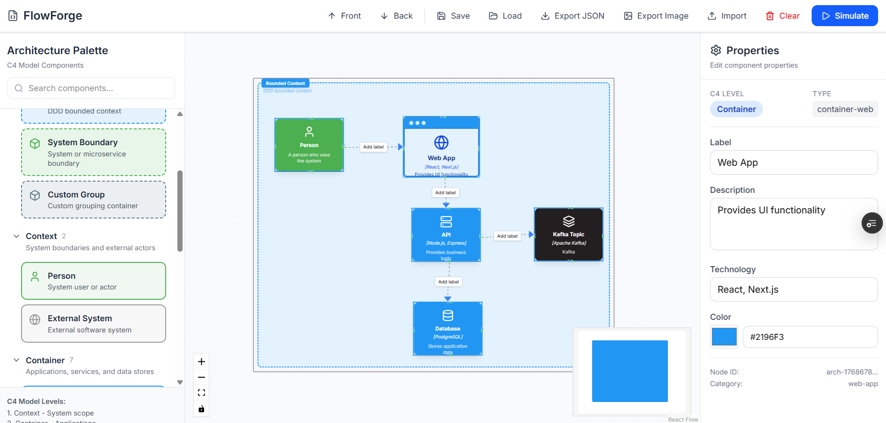
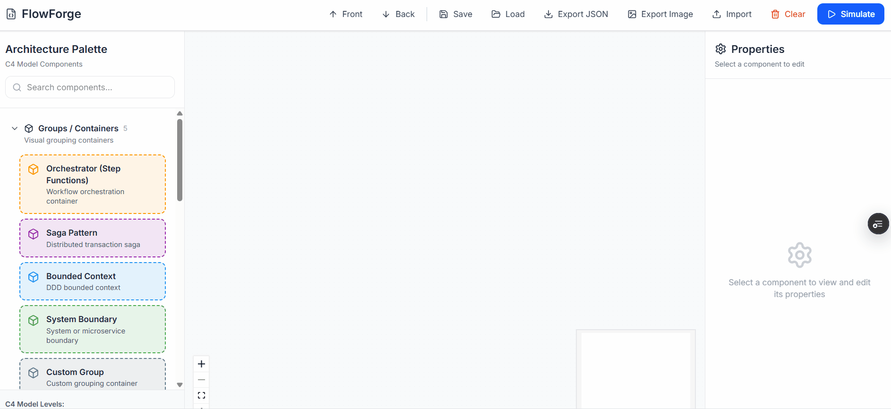
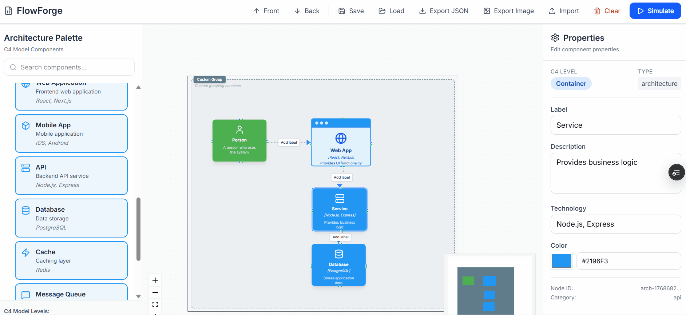
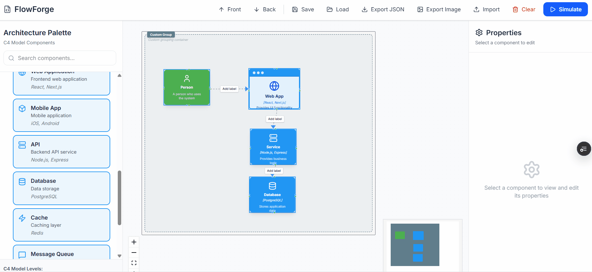

[](https://github.com/7Gabriel/flowforge/actions)
[](https://flowforge-q8oyuuc68-7gabriels-projects.vercel.app/)
[](LICENSE)
[](CONTRIBUTING.md)

<div align="center">
   
  
# 🎨 FlowForge

### *Forge Your Architecture Flows*

**The ultimate C4 Model diagramming tool with live simulation**

[Demo](#-demo) • [Features](#-features) • [Quick Start](#-quick-start) • [Documentation](#-documentation)

[](LICENSE)
[](https://nextjs.org/)
[](https://reactflow.dev/)
[](https://www.typescriptlang.org/)



</div>

---

## 🎯 What is FlowForge?

FlowForge is a **modern, interactive C4 Model architecture diagramming tool** that brings your system designs to life. Unlike static diagram tools, FlowForge lets you **visualize and simulate** data flows through your architecture in real-time.

### Why FlowForge?

- 🎨 **Authentic C4 Model** - Follows official C4 notation (Person, Container, Component, etc.)
- ⚡ **Live Simulation** - Watch data flow through your architecture step-by-step
- 🎯 **Beautiful UI** - Professional, polished interface that rivals paid tools
- 🚀 **Fast & Responsive** - Built with Next.js 15 and React Flow
- 💾 **Import/Export** - Save as JSON or export as PNG images
- 🎨 **Customizable** - Edit colors, labels, descriptions, and more

---

## ✨ Features

### 🏗️ C4 Model Components

| Component Type | Visual Style | Use Case |
|---------------|--------------|----------|
| **Person** | Green rounded box with 👤 icon | System users and actors |
| **External System** | Gray box | Third-party services (AWS, SendGrid, etc) |
| **Container (Web)** | Blue box with browser bar (●●●) | Frontend applications |
| **Container (Service)** | Blue box with terminal icon | Backend services, APIs |
| **Database** | Blue cylinder | Data stores (PostgreSQL, DynamoDB, etc) |
| **Component** | Small blue box | Internal modules, classes |
| **Groups** | Dashed containers | Bounded contexts, system boundaries |

### 🎬 Live Simulation

- ✅ Step-by-step execution visualization
- ✅ Node highlighting during execution (🟠 orange → 🟢 green)
- ✅ Animated edge transitions showing data flow
- ✅ Execution panel with detailed logs
- ✅ Real-time progress tracking

### 🎨 Visual Editor

- ✅ Drag-and-drop interface
- ✅ Resizable nodes (select and drag corners)
- ✅ Bidirectional connections (8 handles per node)
- ✅ Z-index control (bring to front/send to back)
- ✅ Edge styles: solid, dashed, dotted, animated
- ✅ Editable labels and descriptions
- ✅ Custom colors for nodes

### 💾 Import/Export

- ✅ **Save** - Browser storage for quick saves
- ✅ **Load** - Restore saved diagrams
- ✅ **Export JSON** - Full diagram data export
- ✅ **Export PNG** - High-quality image export
- ✅ **Import** - Load saved diagrams

---

## 🎥 Demo

### Creating an Architecture Diagram


### Simulating Data Flow


### Editing Properties


---

## 🚀 Quick Start

### Prerequisites

- Node.js 18+ 
- npm, yarn, or pnpm

### Installation
```bash
# Clone the repository
git clone https://github.com/7Gabriel/FlowForge.git
cd flowforge

# Install dependencies
npm install

# Run development server
npm run dev
```

Open [http://localhost:3000](http://localhost:3000) to see FlowForge in action! 🎉

---

## 📖 Usage Guide

### 1️⃣ Create Your Architecture

1. **Add Components**
   - Drag components from the left palette onto the canvas
   - Start with a **Person** node (green) as your entry point
   - Add **Containers** (blue) for your applications/services
   - Add **Database** (cylinder) for data storage

2. **Connect Nodes**
   - Click and drag from a handle (small circle) on one node
   - Release on a handle of another node
   - Connection is created with an arrow

3. **Organize Layout**
   - Drag nodes to reposition
   - Use **Front/Back** buttons to adjust z-index
   - Create **Groups** to organize related components

### 2️⃣ Customize Components

Click any node to open the **Properties Panel** on the right:

- **Label**: Component name (e.g., "User", "API Gateway")
- **Description**: Detailed explanation (e.g., "Authenticates user requests")
- **Technology**: Tech stack (e.g., "Node.js, Express")
- **Color**: Custom border color

### 3️⃣ Simulate Data Flow

1. Click the **Simulate** button in the toolbar
2. Watch as:
   - Nodes light up in sequence (🟠 executing → 🟢 success)
   - Edges animate to show data flow
   - Execution panel tracks progress
3. Review execution logs in the right panel

### 4️⃣ Save & Export

**Save for later:**
- Click **Save** - Stores in browser

**Export your work:**
- **Export JSON** - Download full diagram data
- **Export PNG** - Save as high-quality image

**Import existing:**
- Click **Import** - Load a saved JSON file

---

## 🏗️ Architecture & Tech Stack

### Frontend Stack
```
Next.js 15 (App Router)
├── React 19
├── TypeScript 5
├── Tailwind CSS 3
└── React Flow 11
```

### Key Libraries

- **React Flow** - Canvas & node management
- **@reactflow/node-resizer** - Resizable nodes
- **Lucide React** - Beautiful icons
- **html-to-image** - PNG export
- **Tailwind CSS** - Styling

### Project Structure
```
flowforge/
├── src/
│   ├── app/
│   │   ├── page.tsx              # Main application
│   │   ├── layout.tsx            # Root layout
│   │   └── globals.css           # Global styles
│   │
│   ├── components/
│   │   ├── architecture/
│   │   │   ├── nodes/            # C4 node components
│   │   │   │   ├── PersonNode.tsx
│   │   │   │   ├── ContainerWebNode.tsx
│   │   │   │   ├── ContainerServiceNode.tsx
│   │   │   │   ├── DatabaseNode.tsx
│   │   │   │   ├── ExternalSystemNode.tsx
│   │   │   │   ├── ComponentNode.tsx
│   │   │   │   └── GroupNode.tsx
│   │   │   │
│   │   │   ├── edges/            # Edge components
│   │   │   │   └── EditableEdge.tsx
│   │   │   │
│   │   │   ├── properties/       # Properties editors
│   │   │   │   ├── ArchitecturePropertiesPanel.tsx
│   │   │   │   ├── ArchitecturePropertiesEditor.tsx
│   │   │   │   └── GroupPropertiesEditor.tsx
│   │   │   │
│   │   │   └── ArchitectureNodePalette.tsx
│   │   │
│   │   └── workflow/
│   │       ├── WorkflowCanvas.tsx        # Main canvas
│   │       ├── WorkflowProvider.tsx
│   │       ├── toolbar/
│   │       │   └── Toolbar.tsx           # Top toolbar
│   │       └── execution/
│   │           └── ExecutionPanel.tsx    # Simulation panel
│   │
│   ├── lib/
│   │   ├── architecture/
│   │   │   ├── c4-types.ts              # TypeScript types
│   │   │   ├── c4-templates.ts          # Node templates
│   │   │   ├── group-templates.ts       # Group templates
│   │   │   └── icon-registry.ts         # Icon mapping
│   │   │
│   │   └── workflow/
│   │       └── execution/
│   │           └── architecture-executor.ts  # Simulation engine
│   │
│   └── contexts/
│       ├── AppModeContext.tsx
│       └── WorkflowExecutionContext.tsx
│
├── public/                      # Static assets
├── docs/                        # Documentation & screenshots
└── README.md
```

---

## 🎨 C4 Model Compliance

FlowForge strictly follows the [C4 Model](https://c4model.com/) notation created by Simon Brown.

### Visual Styles

| C4 Level | Component | FlowForge Style |
|----------|-----------|-----------------|
| **Context** | Person | 🟢 Green rounded box with user icon |
| **Context** | External System | gray rectangular box |
| **Container** | Web Application | 🔵 Blue box with browser bar (●●●) |
| **Container** | Backend Service | 🔵 Blue box with terminal icon |
| **Container** | Database | 🔵 Blue cylinder shape |
| **Component** | Internal Module | 🔵 Small blue rectangular box |

### C4 Model Levels
```
📊 System Context
   └── Shows high-level system interactions
       ├── Person (users/actors)
       └── External Systems

📦 Container
   └── Shows applications and data stores
       ├── Web Applications
       ├── Mobile Apps
       ├── Backend Services
       └── Databases

🧩 Component
   └── Shows internal structure
       ├── Controllers
       ├── Services
       └── Repositories
```

---

## 🛠️ Development

### Run Development Server
```bash
npm run dev
```

Server starts at [http://localhost:3000](http://localhost:3000)

### Build for Production
```bash
npm run build
npm start
```

### Lint Code
```bash
npm run lint
```

### Format Code
```bash
npm run format
```

---

## 🤝 Contributing

Contributions are welcome! Please feel free to submit a Pull Request.

### How to Contribute

1. **Fork** the repository
2. **Create** your feature branch
```bash
   git checkout -b feature/AmazingFeature
```
3. **Commit** your changes
```bash
   git commit -m 'Add some AmazingFeature'
```
4. **Push** to the branch
```bash
   git push origin feature/AmazingFeature
```
5. **Open** a Pull Request

### Development Guidelines

- Follow existing code style
- Write descriptive commit messages
- Add comments for complex logic
- Test your changes thoroughly
- Update documentation if needed

---

## 🗺️ Roadmap

### Version 2.0 (Planned)

- [ ] **Templates Gallery** - Pre-built architecture templates
  - Microservices architecture
  - Event-driven architecture
  - Serverless architecture
  - Monolithic architecture

- [ ] **Undo/Redo** - Full history support
  - Ctrl+Z for undo
  - Ctrl+Y for redo
  - History timeline

- [ ] **Code Export**
  - PlantUML generation
  - Mermaid diagram export
  - Structurizr DSL export

### Version 3.0 (Future)

- [ ] **Collaboration**
  - Real-time multi-user editing
  - Comments and annotations
  - Version control

- [ ] **Cloud Storage**
  - Save diagrams to cloud
  - Share via URL
  - Team workspaces

- [ ] **Enhanced Visuals**
  - Dark mode
  - Custom themes
  - Official cloud provider icons (AWS, Azure, GCP)

- [ ] **Advanced Features**
  - Auto-layout algorithms
  - Diagram validation
  - Architecture metrics
  - Cost estimation integration

---

## 📄 License

This project is licensed under the **MIT License** - see the [LICENSE](LICENSE) file for details.

### MIT License Summary

✅ Commercial use  
✅ Modification  
✅ Distribution  
✅ Private use  

---

## 👨‍💻 Author

**João Gabriel** - *Software Architect with 15 years of IT experience*

- 💼 LinkedIn: [Joao Gabriel](https://linkedin.com/in/joao-gabriel-matuto)
- 🐙 GitHub: [@7Gabriel](https://github.com/7Gabriel)


---

## 🙏 Acknowledgments

- **[Simon Brown](https://simonbrown.je/)** - Creator of the C4 Model
- **[C4 Model](https://c4model.com/)** - Architecture visualization methodology
- **[React Flow](https://reactflow.dev/)** - Amazing diagramming library
- **[Vercel](https://vercel.com/)** - Deployment platform
- **[Lucide](https://lucide.dev/)** - Beautiful icon library
- **[Tailwind CSS](https://tailwindcss.com/)** - Utility-first CSS framework

---

## 📊 Project Stats

- **Lines of Code**: ~8,000+
- **Components**: 20+
- **Node Types**: 7 (Person, External System, Container x2, Database, Component, Group)
- **Features**: 15+
- **Development Time**: 2 weeks

---

## ⭐ Star History

If you find **FlowForge** useful, please give it a ⭐ on GitHub!

[](https://star-history.com/#7Gabriel/flowforge&Date)

---

## 📸 Screenshots

### Main Interface


---

<div align="center">

### 🎨 **FlowForge** - *Forge Your Architecture Flows*

**by João Gabriel**

[⬆ Back to Top](#-flowforge)

</div>